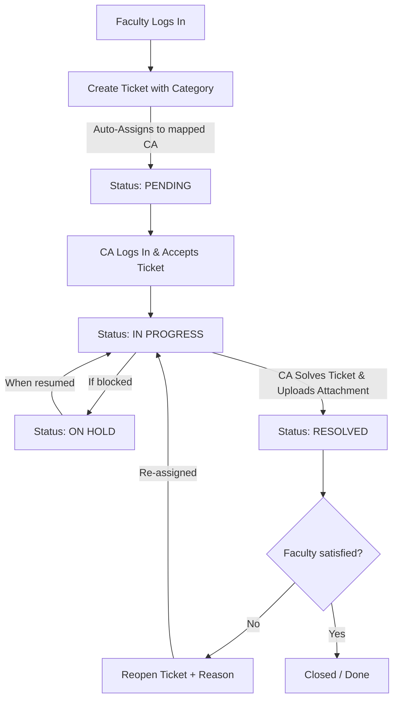

# 🎫 SNIST Helpdesk Platform

A role-based helpdesk ticketing system built with **Flask** and **MySQL**, designed for Sreenidhi Institute of Science and Technology. Faculty can raise tickets, Concerned Authorities resolve them, and HODs / Admins manage the workflow.

---

## 📋 Table of Contents

- [Features](#features)
- [Tech Stack](#tech-stack)
- [Prerequisites](#prerequisites)
- [Installation](#installation)
- [Configuration](#configuration)
- [Running the Project](#running-the-project)
- [Demo Accounts](#demo-accounts)
- [Project Structure](#project-structure)

---

## ✨ Features

- **Role-Based Access Control** — Super Admin, Admin, HOD, Concerned Authority (CA), Faculty
- **Ticket Lifecycle** — Create → Pending → In Progress → Resolved
- **Auto-Assignment** — Tickets auto-assigned to the mapped CA based on category
- **CA Reports** — Resolution time tracking for Concerned Authorities
- **User & Category Management** — Full CRUD for users and category-to-CA mappings
- **CSV / Excel Export** — Download filtered ticket data
- **File Attachments** — Upload supporting documents during ticket updates
- **Search & Filters** — Filter by status, department, organization, and date range

---

## 🛠 Tech Stack

| Layer     | Technology       |
|-----------|------------------|
| Backend   | Python 3.10+, Flask 3.1 |
| Database  | MySQL (via PyMySQL) |
| Frontend  | Jinja2 Templates, Vanilla CSS |
| Auth      | Session-based (Flask sessions) |

---

## ✅ Prerequisites

Make sure you have the following installed:

- **Python 3.10+** — [Download](https://www.python.org/downloads/)
- **MySQL 8.0+** — [Download](https://dev.mysql.com/downloads/)
- **Git** — [Download](https://git-scm.com/downloads)

---

## 🚀 Installation

### 1. Clone the Repository

```bash
git clone https://github.com/bhaskar1461/snist_helpdesk.git
cd snist_helpdesk
```

### 2. Create a Virtual Environment

```bash
python3 -m venv .venv
```

### 3. Activate the Virtual Environment

**Linux / macOS:**

```bash
source .venv/bin/activate
```

**Windows:**

```bash
.venv\Scripts\activate
```

### 4. Install Dependencies

```bash
pip install -r requirements.txt
```

---

## ⚙️ Configuration

### 5. Create the Environment File

Copy the example file and edit it with your MySQL credentials:

```bash
cp .env.example .env
```

Open `.env` and update the values:

```env
# MySQL Database Configuration
MYSQL_HOST=localhost
MYSQL_USER=your_mysql_user
MYSQL_PASSWORD=your_mysql_password
MYSQL_DATABASE=snist_helpdesk
MYSQL_PORT=3306

# Flask Secret Key (change this in production!)
SECRET_KEY=your-secret-key-here

# Set to 'false' to skip demo schema initialization on startup
INIT_DEMO_DB=true
```

### 6. Create the MySQL Database

Log in to MySQL and create the database:

```bash
mysql -u root -p
```

```sql
CREATE DATABASE snist_helpdesk CHARACTER SET utf8mb4 COLLATE utf8mb4_unicode_ci;
EXIT;
```

> **Note:** When `INIT_DEMO_DB=true`, the app will automatically create all required tables and seed demo data on first run.

---

## ▶️ Running the Project

### 7. Start the Application

```bash
python app.py
```

The server will start at:

```
http://127.0.0.1:5000
```

Open this URL in your browser to access the login page.

---

## 👤 Demo Accounts

When `INIT_DEMO_DB=true`, the following demo accounts are created automatically:

| Role         | Email                      | Password | Department     |
|--------------|----------------------------|----------|----------------|
| Super Admin  | admin@gmail.com            | 123      | Administration |
| Admin        | campus.admin@gmail.com     | 123      | Administration |
| HOD (CSE)    | hod@gmail.com              | 123      | CSE            |
| HOD (ECE)    | hod.ece@gmail.com          | 123      | ECE            |
| CA           | ca@gmail.com               | 123      | CSE            |
| CA           | sravan.ca@gmail.com        | 123      | Facilities     |
| CA           | bhaskar.ca@gmail.com       | 123      | Maintenance    |
| Faculty      | faculty@gmail.com          | 123      | CSE            |

---

## 👥 User Roles, Hierarchy & Permissions

The platform uses a granular Role-Based Access Control (RBAC) system to partition features, dashboards, and ticket visibility:

### 1. Hierarchy & Permissions Matrix

| Role | Hierarchy Level | Key Permissions | Scoping & Data Visibility Restrictions |
|:---|:---:|:---|:---|
| **Super Admin** | 1 (Highest) | Full system control. Create, update, or delete all users (including Admins/Super Admins). Manage Category-to-CA mappings across all departments. | Organization-wide control |
| **Admin** | 2 | Organization panel. Create, update, or delete users (except Super Admin). Manage Category-to-CA mappings. | Scoped to own organization |
| **HOD (Head of Department)** | 3 | Manage CAs and Faculty members strictly within their department. Manage Category-to-CA mappings for their department. Monitor department-specific tickets. | Strictly scoped to own department |
| **Concerned Authority (CA)** | 4 | Track assigned tickets. Transition ticket states (Pending ➔ In Progress ➔ On Hold ➔ Resolved). Add resolution remarks and upload files. View resolution reports. | Scoped to tickets assigned to them |
| **Faculty (User)** | 5 | Create tickets. View and search own raised tickets. Reopen resolved tickets (requires explanation). | Scoped to tickets raised by them |

---

## 🔄 Ticketing & User Management Workflows

### A. The Ticketing Lifecycle Flow



1. **Ticket Raising:** A **Faculty** member logs in, chooses a Category (e.g. `Internet` or `Plumbing`), enters the title/description, and optionally links a physical location.
2. **Auto Routing:** The database automatically routes the ticket to the mapped **Concerned Authority (CA)** assigned to that category. The status is initialized to `PENDING`.
3. **Acceptance:** The **CA** views their assigned queue and moves the ticket to `IN_PROGRESS`.
4. **On Hold State:** If the issue requires external parts or is blocked, the CA can change the status to `ON_HOLD` (adding a remarks note). When ready, they transition it back to `IN_PROGRESS`.
5. **Resolution:** The CA sets the ticket status to `RESOLVED`, typing out clear resolution remarks and uploading optional files (such as photo evidence).
6. **Reopening:** If the problem persists, the **Faculty** can reopen the ticket to `REOPENED` status (remarks required), which re-assigns it back to the CA for further work.

### B. HOD Management Workflow
1. **Login & Interface:** The HOD logs in and accesses their department-specific dashboard, showing Category-to-CA mapping stats and active tickets.
2. **Restricted User Management:** The HOD can access the **User Management** screen. They can view, create, edit, or delete `CA` and `FACULTY` users who belong to their department. Admins and other departments' users are hidden and cannot be updated.
3. **Category Mappings:** The HOD maps category names to CAs in their department. If creating/editing a multi-department CA (e.g., handling Maintenance across CSE and ECE), the HOD's own department is locked as selected, but they can associate other departments as needed.

---

## 📁 Project Structure

```
snist_helpdesk/
├── app.py                  # Main Flask application (routes & RBAC checks)
├── db_services.py          # Database service layer (MySQL queries & model methods)
├── requirements.txt        # Python dependencies
├── .env.example            # Environment variable template
├── .gitignore              # Git ignore rules
├── management_data.json    # Management config data
├── tickets.json            # Sample ticket data
├── sql/
│   └── demo_schema.sql     # Database schema (auto-applied)
├── scripts/
│   └── init_demo_db.py     # Standalone DB initialization script
├── static/
│   ├── css/                # Stylesheets (super_admin.css contains form & input styling)
│   └── images/             # Static images
├── templates/              # Jinja2 HTML templates
│   ├── login.html
│   ├── faculty_dashboard.html
│   ├── management_dashboard.html
│   ├── authority_tickets.html
│   ├── ticket_detail.html
│   ├── create_ticket.html
│   ├── user_management.html
│   ├── category_management.html
│   └── ...
└── uploads/                # User-uploaded attachments (gitignored)
```

---

## 📝 License

This project is developed for academic purposes at SNIST.
