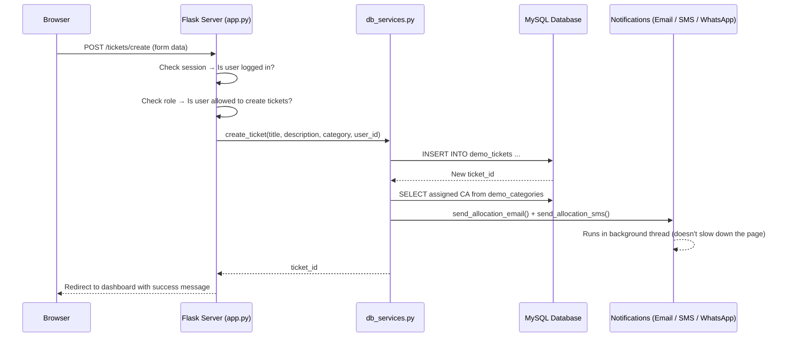
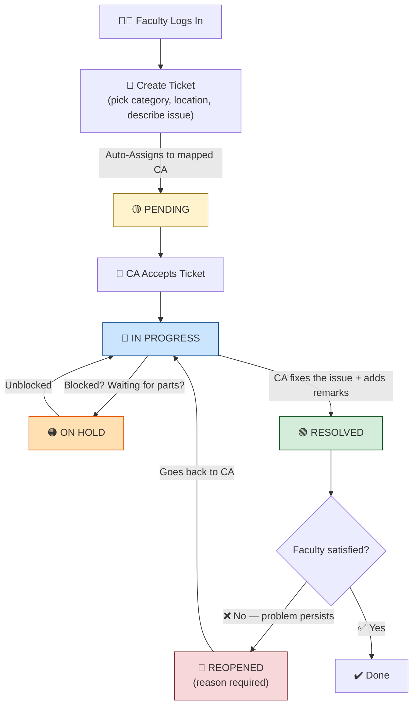
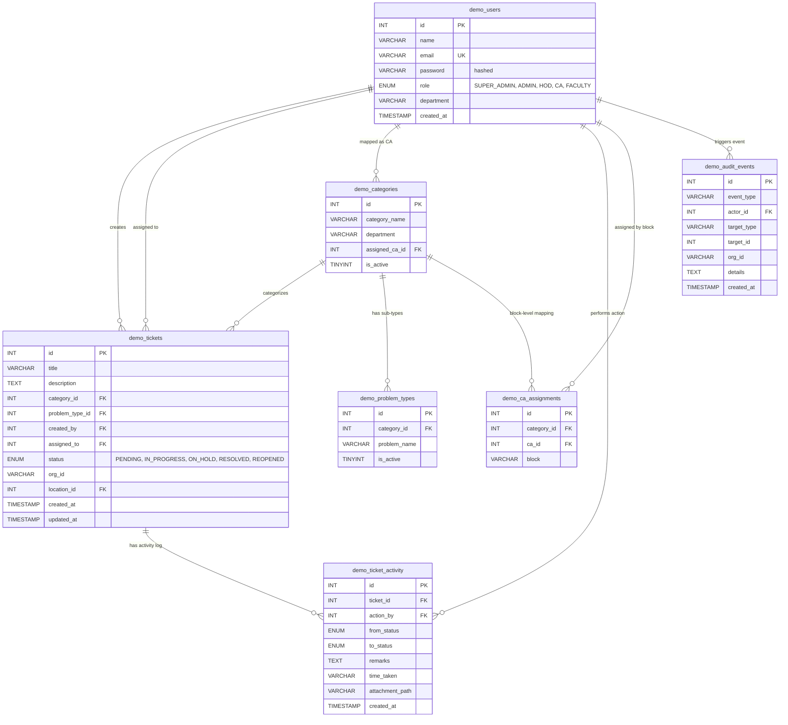

# 🎫 SNIST ICT Helpdesk Platform

> A **role-based helpdesk ticketing system** built for Sreenidhi Institute of Science and Technology (SNIST) and Sreenidhi University (SNU). Faculty members raise complaints, Concerned Authorities fix them, and HODs and Admins supervise the entire process — all from a single web application.

---

## 📋 Table of Contents

- [What Does This Project Do?](#what-does-this-project-do)
- [How It Works — The Big Picture](#how-it-works--the-big-picture)
- [User Roles Explained](#user-roles-explained)
- [The Life of a Ticket](#the-life-of-a-ticket)
- [Features](#features)
- [Notification System](#notification-system)
- [Tech Stack](#tech-stack)
- [Database Design](#database-design)
- [Security](#security)
- [Prerequisites](#prerequisites)
- [Installation](#installation)
- [Configuration](#configuration)
- [Running the Project](#running-the-project)
- [Demo Accounts](#demo-accounts)
- [Deployment](#deployment)
- [Project Structure](#project-structure)
- [REST API Reference](#rest-api-reference)
- [License](#license)

---

## 🧩 What Does This Project Do?

Imagine your classroom projector stops working. Today you might walk to the IT office, fill out a paper form, and hope someone fixes it. You have no idea _who_ is working on it, or _when_ it will be done.

**This Helpdesk Platform replaces that paper form with a web app.** Here is what happens instead:

1. **You log in** with your college email.
2. **You create a ticket** — pick a category (like "Projector"), choose your building and room, and describe the problem.
3. The system **automatically assigns** the right person (called a **Concerned Authority** or CA) to fix it.
4. That person gets an **SMS, WhatsApp alert, and email** telling them there is a new ticket.
5. You can **track the status** on your dashboard — Pending → In Progress → Resolved.
6. When it is fixed, **you get notified** and can confirm the fix or reopen the ticket if the problem continues.

Everyone — from the Faculty who reported the issue, to the CA who fixes it, to the HOD who supervises the department — sees **only the data they are allowed to see**. That is called **Role-Based Access Control (RBAC)**.

---

## 🏗 How It Works — The Big Picture

Think of the application as three layers stacked on top of each other, like floors of a building:

```
┌──────────────────────────────────────────┐
│          FRONTEND (What you see)         │  HTML pages, CSS styling, sidebar navigation
├──────────────────────────────────────────┤
│        BACKEND (The brain / logic)       │  Flask web server, routes, RBAC rules, notifications
├──────────────────────────────────────────┤
│       DATABASE (Where data lives)        │  MySQL tables for users, tickets, categories, activity
└──────────────────────────────────────────┘
```

**Frontend** — Built with **HTML templates** (Jinja2) and **CSS**. When you click a button, the browser sends a request to the backend.

**Backend** — A **Python Flask** web server. It receives your request, checks your role and permissions, talks to the database, and sends back the right page. It is also responsible for sending email, SMS, and WhatsApp alerts.

**Database** — A **MySQL** database. It stores everything: user accounts, ticket details, activity logs, categories, locations, and audit events.

### How a single click flows through the system



---

## 👥 User Roles Explained

The system has **5 roles**, arranged in a hierarchy from most powerful to least powerful:

| # | Role | Who is this? | What can they do? |
|:-:|:-----|:-------------|:------------------|
| 1 | **Super Admin** | The system administrator | Full control — manage all users, all departments, all categories, all tickets, all locations. Can impersonate any HOD to work on their behalf. |
| 2 | **Admin** | A campus-level administrator | Same as Super Admin, but _cannot_ create or modify other Super Admins. Scoped to their own organization (SNIST or SNU). |
| 3 | **HOD** | Head of Department (e.g., HOD of CSE) | Manages CAs and Faculty _within their department only_. Maps categories (like "Internet" or "Projector") to specific CAs. Views department tickets. |
| 4 | **CA** | Concerned Authority (the fixer) | Receives assigned tickets. Updates status (Pending → In Progress → On Hold → Resolved). Adds resolution remarks and uploads evidence photos. |
| 5 | **Faculty** | A teacher or staff member | Creates tickets (raises complaints). Views only their own tickets. Can reopen resolved tickets if the problem was not actually fixed. |

### Multi-Organization Support

The platform supports **two organizations** side by side:

| Org ID | Organization | Domain |
|:------:|:-------------|:-------|
| 2000 | Sreenidhi Institute of Science and Technology (SNIST) | `sreenidhi.edu.in` |
| 3000 | Sreenidhi University (SNU) | `suh.edu.in`, `snu.edu.in` |

A Super Admin at SNIST **cannot see** SNU tickets, users, or categories — and vice versa. The system automatically determines your organization from your email domain.

---

## 🔄 The Life of a Ticket

Every ticket goes through a series of **status changes**. Think of it like a package being tracked — it moves from one stage to the next:



### Step-by-step breakdown

1. **Create** — A Faculty user logs in, chooses a category (e.g., "Internet" under the "ICT" department), selects their building block, floor, and room number, and writes a description like _"WiFi not working in room 301"_.

2. **Auto-Assignment** — The system looks up which CA is mapped to that category and (optionally) that building block, and assigns the ticket to them automatically. The ticket starts as **PENDING**.

3. **Accept** — The CA sees the new ticket on their dashboard. They move it to **IN_PROGRESS** to signal they are working on it.

4. **On Hold** _(optional)_ — If the CA is waiting for a spare part or external help, they can park the ticket in **ON_HOLD** and add a note explaining why.

5. **Resolve** — When the CA fixes the issue, they change the status to **RESOLVED**, type resolution remarks (e.g., _"Replaced the router"_), and optionally upload a photo as proof.

6. **Reopen** _(optional)_ — If the Faculty checks and the problem is not actually solved, they can **REOPEN** the ticket with an explanation. The ticket goes back to the same CA.

---

## ✨ Features

### Core Features
- **Role-Based Access Control (RBAC)** — Every page, every button, every API endpoint checks your role first. A Faculty user can never see the User Management page, and an HOD can never see tickets from another department.
- **Auto-Assignment Engine** — When a ticket is created, the system uses the category-to-CA mapping table to assign the right person instantly — no manual routing needed.
- **Ticket Lifecycle Management** — Full support for PENDING → IN_PROGRESS → ON_HOLD → RESOLVED → REOPENED transitions, with guards that prevent invalid jumps (e.g., you cannot go directly from PENDING to RESOLVED).
- **Activity Log** — Every status change is recorded in `demo_ticket_activity` with timestamps, who made the change, remarks, and optional file attachments.

### Category & Problem Type System
- **Dynamic Category Cascading** — When creating a ticket, the category dropdown filters automatically based on the department you select (e.g., ICT, HCM, Facilities, PM, MM, LSM).
- **Problem Types** — Each category can have specific problem types (e.g., under "Internet" → "Slow Speed", "No Connection", "WiFi Down"). Users can also type "Other" and create a new problem type on the fly.
- **Category Activation/Deactivation** — HODs and Super Admins can temporarily disable categories without deleting them.

### Location Management
- **Block → Floor → Room** hierarchy for physical locations across campus.
- When creating a ticket, users pick their exact location from cascading dropdowns.
- Locations are used by the CA assignment engine to route tickets to the right person by building block.

### User Management
- **Full CRUD** (Create, Read, Update, Delete) for demo users.
- **HOD-scoped permissions** — An HOD can only manage CA and Faculty users within their own department.
- **Auto-Provisioning** — Teachers from the live `teacher_info` database table can log in with their SAP ID as the password. The system automatically creates a demo account for them on first login.
- **CA Promotion** — When mapping a category to a Faculty member, the system automatically promotes that user to the CA role.

### HOD Impersonation
- Super Admins and Admins can **impersonate any HOD** — the sidebar changes, the dashboard changes, and all permissions match the HOD role. Useful for system testing or helping a department.
- Every impersonation event is logged in the **audit trail** with start time, department, and who was impersonating.

### Data Export
- **CSV Export** — Download filtered ticket data as a `.csv` file (opens in Excel, Google Sheets, etc.).
- **Excel Export** — Download as `.xls` for direct use in Microsoft Excel.
- Export respects RBAC — Faculty can only export their own tickets, CAs can only export their assigned tickets.

### Search & Filters
- Filter tickets by **status**, **department**, **organization**, and **date range**.
- Search users by **name**, **email**, or **department**.
- Search categories by **name**, **CA**, or **department**.

---

## 📬 Notification System

The platform sends **three types of alerts** when important things happen:

| Channel | Trigger | Template |
|:--------|:--------|:---------|
| **Email (SMTP)** | Ticket assigned to CA | _"Dear {name}, A helpdesk ticket ID with #{id} about {category} has been allocated to you. Please attend to it immediately. — ICT Sreenidhi"_ |
| **Email (SMTP)** | Ticket resolved | _"Dear staff, Your ICT complaint ticket id : #{id} is closed, please check and if you are not satisfied reopen the same ticket id. — ICT"_ |
| **SMS (BulkSMS API)** | Ticket assigned to CA | _"Dear {name}, A ticket id with {id} about System has been allocated to you, pls attend to it immediately. — ICT"_ |
| **SMS (BulkSMS API)** | Ticket resolved | _"Dear staff, Your ICT complaint ticket id : {id} is closed, please check and if you are not satisfied reopen the same ticket id. — ICT"_ |
| **WhatsApp** | Same as SMS | Same templates. Uses a configurable API URL, or falls back to simulation logging. |

### How it works under the hood

All notifications are sent **asynchronously** in background **daemon threads**. This means the user does not have to wait for the SMS or email to be delivered — the page loads immediately, and the notification fires in the background.

```python
# Simplified example from sms_services.py
def send_sms_async(phone_number, message):
    thread = threading.Thread(target=_send_sms_sync, args=(phone_number, message), daemon=True)
    thread.start()  # Fire and forget — doesn't block the web request
```

### Configuration

| Variable | Purpose | Example |
|:---------|:--------|:--------|
| `SMTP_HOST` | Mail server hostname | `mail.sreenidhi.edu.in` |
| `SMTP_PORT` | Mail server port | `587` |
| `SMTP_USER` | Email account for sending | `support.helpdesk@sreenidhi.edu.in` |
| `SMTP_PASSWORD` | Email account password | _(your password)_ |
| `SMS_API_KEY` | BulkSMS API key | `c69fc621-e477-...` |
| `SMS_SENDER` | Registered sender ID | `SNISTA` |
| `SMS_TEST_NUMBER` | Override phone number for testing | `7893811088` |
| `WHATSAPP_ENABLED` | Enable/disable WhatsApp alerts | `true` |
| `WHATSAPP_API_URL` | Custom WhatsApp gateway URL | _(optional)_ |

---

## 🛠 Tech Stack

| Layer | Technology | Why? |
|:------|:-----------|:-----|
| **Language** | Python 3.10+ | Easy to read, rich library ecosystem |
| **Web Framework** | Flask 3.1 | Lightweight and flexible — great for medium-sized apps |
| **Database** | MySQL 8.0+ (via PyMySQL) | Reliable relational database used by many universities |
| **Templating** | Jinja2 | Built into Flask — renders dynamic HTML pages |
| **Styling** | Vanilla CSS | Custom stylesheets (no heavy frameworks like Bootstrap) |
| **Authentication** | Flask Sessions (cookie-based) | Simple and secure — session data stays on the server |
| **CSRF Protection** | Flask-WTF (CSRFProtect) | Prevents cross-site request forgery attacks |
| **Password Hashing** | Werkzeug `generate_password_hash` / `check_password_hash` | Industry-standard bcrypt-style hashing |
| **SMS Gateway** | BulkSMS HTTP API | Sends OTP-style alerts via DLT-registered templates |
| **Email** | Python `smtplib` (SMTP) | Sends formatted email alerts |
| **Deployment** | Docker + AWS Elastic Beanstalk | Containerized for consistency, deployed to AWS cloud |
| **Production Server** | Gunicorn | Production-grade WSGI server (replaces Flask's dev server) |

---

## 🗄 Database Design

The application uses **8 tables** in MySQL. Here is a simplified diagram showing how they relate:



### What each table stores

| Table | Purpose |
|:------|:--------|
| `demo_users` | All user accounts — name, email, hashed password, role, and department. |
| `demo_tickets` | Every complaint/ticket — title, description, who created it, who is assigned, current status, which organization, which location. |
| `demo_categories` | Category-to-CA mapping — e.g., "Internet problems in CSE → assigned to Chandini". |
| `demo_ticket_activity` | A log of every status change — who changed it, from what status to what status, their remarks, and any uploaded files. |
| `demo_problem_types` | Sub-categories under each category — e.g., under "Internet": Slow Speed, No Connection, WiFi Down. |
| `demo_ca_assignments` | Block-level CA assignment — e.g., "Internet problems in A-Block → CA Sravan, B-Block → CA Chandini". |
| `demo_audit_events` | Security audit trail — tracks impersonation events, CA promotions, location changes, and other administrative actions. |
| `teacher_info` _(live)_ | Pre-existing college staff table — used for auto-provisioning and phone number lookup. Not created by this app. |

### Connection Pooling

The app uses a **connection pool** (up to 10 connections) to efficiently reuse MySQL connections instead of opening a new one for every request.

---

## 🔒 Security

| Feature | How it works |
|:--------|:-------------|
| **Password Hashing** | Passwords are never stored as plain text. They are hashed using Werkzeug's `generate_password_hash()` (bcrypt-style). Even if someone steals the database, they cannot read the passwords. |
| **CSRF Protection** | Every form includes a hidden CSRF token. If a malicious website tries to submit a form to our app, the request is rejected because it won't have the correct token. |
| **Rate Limiting** | After 5 failed login attempts from the same IP address within 1 minute, that IP is temporarily locked out. This prevents brute-force password guessing. |
| **Session Security** | Cookies are set with `HttpOnly` (JavaScript cannot read them), `SameSite=Lax` (prevents cross-site attacks), and an optional `Secure` flag for HTTPS. |
| **Content Security Policy** | HTTP headers restrict which scripts, styles, fonts, and images can load on the page — preventing XSS (cross-site scripting) attacks. |
| **Input Validation** | Email format is validated with regex. File uploads are restricted to specific extensions (PDF, PNG, JPG, DOC, etc.) and a 10 MB size limit. Filenames are sanitized. |
| **Role-Based Guards** | Every route uses the `@role_required()` decorator to check the user's role before allowing access. |
| **Timing-Safe Login** | If a Sreenidhi email is entered, the server always does a database lookup (even if the user exists), so an attacker cannot tell from response time whether an account exists. |
| **CSV Injection Prevention** | Exported CSV values are sanitized — any cell starting with `=`, `+`, `-`, or `@` is prefixed with a quote to prevent formula injection in Excel. |
| **Audit Trail** | Administrative actions (impersonation, CA promotion, location changes) are logged in `demo_audit_events` for accountability. |

---

## ✅ Prerequisites

Make sure you have the following installed on your computer:

- **Python 3.10+** — [Download here](https://www.python.org/downloads/)
- **MySQL 8.0+** — [Download here](https://dev.mysql.com/downloads/)
- **Git** — [Download here](https://git-scm.com/downloads)

---

## 🚀 Installation

### 1. Clone the Repository

```bash
git clone https://github.com/bhaskar1461/snist_helpdesk.git
cd snist_helpdesk
```

### 2. Create a Virtual Environment

A virtual environment is like a separate box for this project's libraries — it keeps them isolated from other Python projects on your computer.

```bash
python -m venv .venv
```

### 3. Activate the Virtual Environment

**Windows:**
```bash
.venv\Scripts\activate
```

**Linux / macOS:**
```bash
source .venv/bin/activate
```

### 4. Install Dependencies

```bash
pip install -r requirements.txt
```

This installs:
| Package | What it does |
|:--------|:-------------|
| `Flask` | The web framework |
| `Flask-WTF` | CSRF protection for forms |
| `PyMySQL` | Python driver to talk to MySQL |
| `python-dotenv` | Reads configuration from `.env` file |
| `gunicorn` | Production-grade web server |

---

## ⚙️ Configuration

### 5. Create the Environment File

Copy the example file and edit it with your credentials:

```bash
cp .env.example .env
```

Open `.env` and update the values:

```env
# ── MySQL Database ──────────────────────────────
MYSQL_HOST=localhost
MYSQL_USER=your_mysql_user
MYSQL_PASSWORD=your_mysql_password
MYSQL_DATABASE=snist_helpdesk
MYSQL_PORT=3306

# ── Flask Secret Key ────────────────────────────
# Used to sign session cookies. Generate one with:
#   python -c "import secrets; print(secrets.token_hex(32))"
SECRET_KEY=your-secret-key-here

# ── Demo Data ───────────────────────────────────
# Set to 'false' to skip auto-creating tables and demo accounts
INIT_DEMO_DB=true

# ── Email (SMTP) Notifications ──────────────────
SMTP_HOST=mail.sreenidhi.edu.in
SMTP_PORT=587
SMTP_USER=support.helpdesk@sreenidhi.edu.in
SMTP_PASSWORD=your_smtp_password_here
SMTP_USE_TLS=True
SMTP_SENDER=support.helpdesk@sreenidhi.edu.in

# ── SMS Notifications (BulkSMS API) ─────────────
SMS_API_KEY=c69fc621-e477-43c5-84ea-d9d94108d7cc
SMS_SENDER=SNISTA
SMS_TEST_NUMBER=          # Set a test number to redirect all SMS during development

# ── WhatsApp Notifications ──────────────────────
WHATSAPP_ENABLED=true
WHATSAPP_API_URL=         # Optional: Custom WhatsApp gateway endpoint
```

### 6. Create the MySQL Database

Log in to MySQL and create the database:

```bash
mysql -u root -p
```

```sql
CREATE DATABASE snist_helpdesk CHARACTER SET utf8mb4 COLLATE utf8mb4_unicode_ci;
EXIT;
```

> **Note:** When `INIT_DEMO_DB=true`, the app will automatically create all required tables and seed demo data on the first run. You do **not** need to run any SQL scripts manually.

---

## ▶️ Running the Project

### 7. Start the Application

```bash
python app.py
```

The server will start at:

```
http://127.0.0.1:5000
```

Open this URL in your browser to access the login page.

> **Tip:** For production, use Gunicorn instead of the Flask development server:
> ```bash
> gunicorn --bind 0.0.0.0:5000 app:app
> ```

---

## 👤 Demo Accounts

When `INIT_DEMO_DB=true`, the following demo accounts are created automatically:

### SNIST (org_id = 2000)

| Role | Name | Email | Password | Department |
|:-----|:-----|:------|:---------|:-----------|
| Super Admin | Super Admin | `admin@gmail.com` | `123` | Administration |
| Admin | Campus Admin | `campus.admin@gmail.com` | `123` | Administration |
| HOD | Dr. Kavya | `hod@gmail.com` | `123` | CSE |
| HOD | Dr. Harini | `hod.ece@gmail.com` | `123` | ECE |
| CA | Chandini | `ca@gmail.com` | `123` | CSE |
| CA | Sravan | `sravan.ca@gmail.com` | `123` | Facilities |
| CA | Bhaskar | `bhaskar.ca@gmail.com` | `123` | Maintenance |
| Faculty | Demo User | `faculty@gmail.com` | `123` | CSE |

### SNU (org_id = 3000)

| Role | Name | Email | Password | Department |
|:-----|:-----|:------|:---------|:-----------|
| Super Admin | SNU Admin | `snu.admin@gmail.com` | `123` | Administration |

---

## 🚢 Deployment

### Docker (Local or Any Server)

The project includes a `Dockerfile` and `docker-compose.yml` for containerized deployment:

```bash
docker-compose up --build
```

This builds the Docker image, installs dependencies, and starts the Gunicorn server on port 5000.

### AWS Elastic Beanstalk (Production)

The app is deployed to **AWS Elastic Beanstalk** as a Docker container:

- **Application:** `Proofsy`
- **Environment:** `Proofsy-env`
- **Region:** `us-east-1`
- **URL:** `Proofsy-env.eba-hbxkhm7e.us-east-1.elasticbeanstalk.com`

To deploy a new version:

```bash
python scripts/deploy_to_aws.py
```

This script:
1. Packages the project into a `.zip` file (excluding `.git`, `.venv`, `__pycache__`, `uploads`).
2. Uploads the zip to an S3 bucket.
3. Creates a new application version on Elastic Beanstalk.
4. Updates the environment and monitors until health is **Green**.

---

## 📁 Project Structure

```
snist_helpdesk/
│
├── app.py                      # 🧠 Main Flask application
│                                #    - All route handlers (login, dashboards, ticket CRUD, APIs)
│                                #    - RBAC decorators and permission checks
│                                #    - Database migration logic (runs on startup)
│                                #    - Sidebar navigation, org resolution, session management
│
├── db_services.py              # 🗄️ Database service layer
│                                #    - BaseMySQLService with connection pooling (up to 10 connections)
│                                #    - LiveDbService — reads from the pre-existing college tables
│                                #      (teacher_info, branch_detail, locations, etc.)
│                                #    - DemoDbService — full CRUD for demo_users, demo_tickets,
│                                #      demo_categories, demo_ticket_activity, demo_problem_types,
│                                #      demo_ca_assignments, demo_audit_events
│                                #    - Ticket lifecycle transition rules (ALLOWED_TRANSITIONS)
│                                #    - Analytics queries (dashboard_summary, ticket_stats_by_*)
│
├── email_services.py           # 📧 Async SMTP email notifications
│                                #    - send_allocation_email() — alert CA on new ticket
│                                #    - send_closure_email() — alert creator on ticket resolved
│                                #    - All dispatches run in background daemon threads
│
├── sms_services.py             # 📱 SMS and WhatsApp notifications (BulkSMS HTTP API)
│                                #    - send_allocation_sms() — SMS + WhatsApp to CA
│                                #    - send_closure_sms() — SMS + WhatsApp to ticket creator
│                                #    - DLT-registered template text matching
│                                #    - Configurable WhatsApp gateway (falls back to simulation)
│
├── requirements.txt            # 📦 Python dependencies (Flask, PyMySQL, gunicorn, etc.)
├── .env.example                # 🔧 Template for environment variables
├── .gitignore                  # 🚫 Files and folders excluded from Git
│
├── Dockerfile                  # 🐳 Docker image definition (Python 3.11 slim + Gunicorn)
├── docker-compose.yml          # 🐳 Docker Compose for local deployment
├── apprunner.yaml              # ☁️ AWS App Runner configuration (alternative deployment)
│
├── management_data.json        # 📄 Static management configuration data
├── tickets.json                # 📄 Sample ticket data for reference
│
├── sql/
│   ├── demo_schema.sql         # 📜 Core database schema (4 tables)
│   │                            #    demo_users, demo_categories, demo_tickets, demo_ticket_activity
│   └── migration_v2.sql        # 📜 Migration: adds demo_problem_types and demo_audit_events
│
├── scripts/
│   ├── deploy_to_aws.py        # 🚀 AWS Elastic Beanstalk deployment automation
│   └── init_demo_db.py         # 🌱 Standalone database initialization script
│
├── static/
│   ├── css/
│   │   ├── login.css           # 🎨 Login page styling
│   │   ├── faculty_dashboard.css # 🎨 Faculty/user dashboard styling
│   │   ├── super_admin.css     # 🎨 Admin/management panel styling (shared)
│   │   └── create_ticket.css   # 🎨 Ticket creation form styling
│   ├── js/
│   │   └── sidebar.js          # ⚙️ Sidebar toggle and navigation logic
│   └── images/
│       ├── snist_logo.jpg      # 🏫 SNIST logo
│       ├── snu_logo.webp       # 🏫 SNU logo
│       └── Sree304.jpg         # 🏫 Campus image
│
├── templates/                  # 🖥️ Jinja2 HTML templates (server-side rendered)
│   ├── login.html              #    Login page
│   ├── sidebar.html            #    Collapsible sidebar (shared across all pages)
│   ├── topbar.html             #    Top navigation bar (shared)
│   ├── error.html              #    Error page (404, 500)
│   ├── user_dashboard.html     #    Faculty dashboard (summary + recent tickets)
│   ├── my_tickets.html         #    Faculty — view all own tickets with filters
│   ├── create_ticket.html      #    Ticket creation form (cascading dropdowns)
│   ├── ticket_detail.html      #    Single ticket view with activity log
│   ├── authority_tickets.html  #    CA dashboard (assigned + own tickets)
│   ├── ca_report.html          #    CA resolution report (with time tracking)
│   ├── ca_assignments.html     #    HOD — block-level CA assignment management
│   ├── management_dashboard.html  # Admin/HOD dashboard (stats + HOD overview)
│   ├── management_all_tickets.html # Admin/HOD — all tickets view with export
│   ├── management_create_ticket.html # Admin — create ticket on behalf of users
│   ├── user_management.html    #    CRUD table for managing demo users
│   ├── category_management.html #   CRUD table for category-to-CA mappings
│   ├── problem_type_management.html # CRUD for problem sub-types
│   ├── location_management.html #   CRUD for campus locations (block/floor/room)
│   └── change_password.html    #    Password change form
│
└── uploads/                    # 📎 User-uploaded attachments (gitignored)
```

---

## 🌐 REST API Reference

The application exposes JSON APIs for programmatic access. All endpoints require authentication via session cookies and enforce RBAC.

### Users API

| Method | Endpoint | Roles | Description |
|:-------|:---------|:------|:------------|
| `GET` | `/api/demo/users` | Super Admin, Admin, HOD | List demo users (with optional `?q=`, `?role=`, `?department=` filters) |
| `POST` | `/api/demo/users` | Super Admin, Admin, HOD | Create a new demo user |
| `PUT` | `/api/demo/users/<id>` | Super Admin, Admin, HOD | Update a demo user |
| `DELETE` | `/api/demo/users/<id>` | Super Admin, Admin, HOD | Delete a demo user |

### Categories API

| Method | Endpoint | Roles | Description |
|:-------|:---------|:------|:------------|
| `GET` | `/api/demo/categories` | Super Admin, HOD | List categories with CA mapping |
| `POST` | `/api/demo/categories` | Super Admin, HOD | Create a new category |
| `PUT` | `/api/demo/categories/<id>` | Super Admin, HOD | Update a category |
| `DELETE` | `/api/demo/categories/<id>` | Super Admin, HOD | Delete a category |

### Tickets API

| Method | Endpoint | Roles | Description |
|:-------|:---------|:------|:------------|
| `GET` | `/api/demo/tickets` | All roles | List tickets (scope auto-determined by role) |
| `POST` | `/api/demo/tickets` | All roles | Create a new ticket |
| `GET` | `/api/demo/tickets/<id>` | All roles | Get ticket details + activity |
| `PUT` | `/api/demo/tickets/<id>` | CA, Super Admin | Update ticket status |
| `GET` | `/api/demo/tickets/<id>/activity` | All roles | Get ticket activity log |

### Analytics API

| Method | Endpoint | Roles | Description |
|:-------|:---------|:------|:------------|
| `GET` | `/api/analytics/summary` | HOD, Admin, Super Admin | Dashboard stats, department stats, category stats |

### Utility APIs

| Method | Endpoint | Description |
|:-------|:---------|:------------|
| `GET` | `/api/locations` | Get all locations grouped by block → floor → rooms |
| `GET` | `/api/live/departments` | Get departments from the live college database |
| `GET` | `/api/live/users` | Get reference users from the live teacher directory |
| `GET` | `/api/categories-by-department?department=CSE` | Get active categories for a specific department |
| `GET` | `/api/problem-types/<category_id>` | Get problem types for a specific category |

### Data Export

| Method | Endpoint | Description |
|:-------|:---------|:------------|
| `GET` | `/tickets/export/<scope>.csv` | Export tickets as CSV |
| `GET` | `/tickets/export/<scope>.xls` | Export tickets as Excel |

---

## 📝 License

This project is developed for academic and institutional purposes at **Sreenidhi Institute of Science and Technology (SNIST)** and **Sreenidhi University (SNU)**.

---

<div align="center">

Built with ❤️ by the ICT Team at SNIST

</div>
